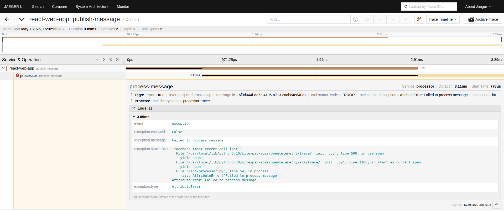

# Tracing Demo

The marker client demonstrates a successful publish and a publish that will simulate a failure in one of the downstream services:

An OpenTelemetry collector like Jaeger can search and display the tracing data it collects from the instrumented services.
Here we can see both the successful and failed publish:

In the successful publish, we can see the hierarchy of the data flow from marker -> processor -> persister, as well as processing times and log messages sent with the trace:

In the failed publish, we can see the processor service encountered an error, so the persister service never activated:

